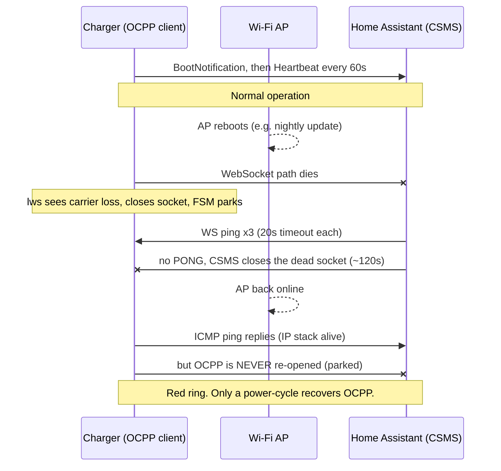
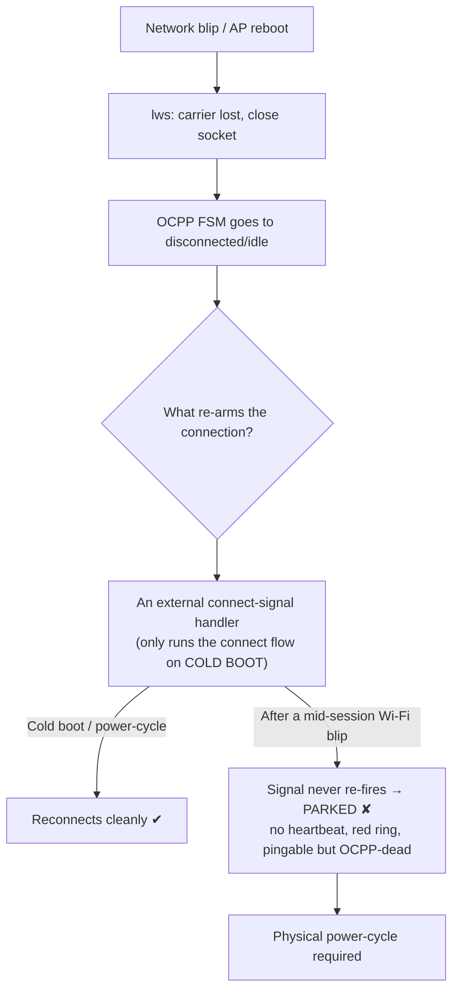
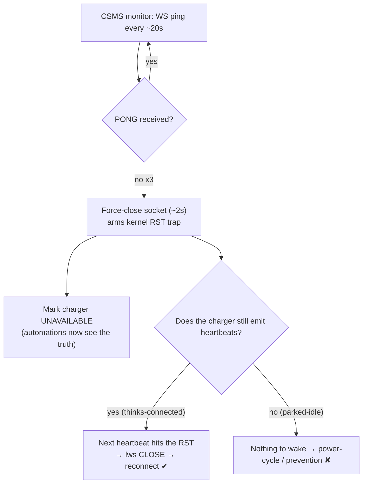

# Huawei FusionCharge AC — OCPP failure analysis & Home Assistant workarounds

> Community documentation of a serious OCPP defect in **Huawei FusionCharge AC** wallboxes, the reverse-engineering that explains it, the Home-Assistant-side workaround in this fork, and a live test showing what the workaround can and cannot fix.
>
> Shared for interoperability and right-to-repair purposes. Not affiliated with or endorsed by Huawei. No proprietary firmware binaries are redistributed here — only analysis, behaviour, and small excerpts for commentary.

## TL;DR

The Huawei FusionCharge AC OCPP client has **no dead-peer detection of any kind**. After any transient network interruption (e.g. a nightly Wi‑Fi AP reboot), it loses the OCPP/WebSocket session and **never re-establishes it** — it sits there pingable on the IP network but OCPP-dead, showing the fault LED ("red ring"), until a **physical mains power-cycle**. Charging itself is unaffected; remote status/control via OCPP is lost.

A CSMS-side (Home Assistant) workaround can **detect** the dead peer fast and keep HA's state honest, and *sometimes* nudge the charger back — but it **cannot reliably wake a charger that has parked**. The only fully reliable fix is to **stop the network from blipping** (wire the charger / don't reboot its AP).

## Scope (tested hardware/firmware)

| | |
|---|---|
| Product | Huawei FusionCharge AC (model `SCharger-7KS-S0`, 7.4 kW) |
| Board | `EU_CHARGE0001` · equipment type `45577 (0xB209)` |
| App firmware | `FusionCharge V100R023C10SPC220` (build B002) — the build that exposes OCPP 1.6, shipped as **beta** |
| BSP firmware | `V300R024C10SPC327` |
| Protocol | OCPP 1.6‑J over WebSocket |
| Datasheet claim | "User Interface & Communications → Protocol: **Modbus TCP, OCPP 1.6**" |

OCPP has been observed to exist only in *some* firmware builds (present in `…-060`, absent in `…-120`, `160T` unconfirmed) and to be non-functional in others — see the community threads linked at the bottom.

## The defect

When the charger loses its network path mid-session:

1. Its libwebsockets layer eventually sees the socket die and tears it down.
2. The OCPP state machine drops to a disconnected/idle state — **and stays there**.
3. It does **not** re-initiate the OCPP connection on its own. It only runs its full connect/registration flow on a **cold boot**.
4. Result: the charger is reachable on IP but never reconnects to the CSMS; the ring goes red; recovery needs a power-cycle.

### Failure sequence

### Why it never recovers

Reconnection in this firmware is **not autonomous** — it is gated on an external "connect" signal that only re-fires on a cold boot:

The reverse-engineering behind this (no WebSocket keepalive, fire-and-forget heartbeats, FSM driven only by stored state) is documented in **[firmware-reverse-engineering.md](firmware-reverse-engineering.md)**.

## The Home-Assistant-side workaround (this fork)

Since the charger can't self-heal, the CSMS has to be the active party. This fork makes the OCPP central system:

1. **Detect the dead peer fast** — `monitor_connection()` sends WebSocket pings; after a few unanswered pings it force-closes the socket within ~2 s (arming the OS to reset the charger's next packet).
2. **Keep HA's state honest** — on close, the charger entities go `unavailable`, so automations stop acting on a phantom "Available" charger.
3. **Pace a possible wake** — the BootNotification interval is lowered to **60 s** and a heartbeat-gap monitor (`_TIMEOUT_S` ≈ 180 s) is the reliable detector (the charger's libwebsockets auto-answers WS pings even while the OCPP app is frozen, so a missing *OCPP heartbeat* is the trustworthy signal).

These changes live in [`custom_components/ocpp/ocppv16.py`](../../custom_components/ocpp/ocppv16.py); see releases tagged `…-fork.N`.

## Live test (what actually happens)

A controlled test — charger connected and healthy, then its AP rebooted, then restored:

| Time (relative) | Event |
|---|---|
| T0 | Charger connected, Heartbeat every 60 s |
| +~0:00 | AP rebooted → WebSocket path dies |
| +~1:00 / +1:40 / +2:20 | CSMS WS pings time out (3×) |
| +~2:20 | CSMS force-closes the dead socket, marks charger `unavailable` |
| +~2 min | AP back; charger answers ICMP ping (0% loss) |
| +2 min → +14 min | **No OCPP reconnect** — no BootNotification, no Heartbeat, red ring throughout |
| — | Recovered only by a physical power-cycle |

**Verdict:** the CSMS-side detection/close works perfectly; the *wake* does not, because this firmware **parks and stops emitting heartbeats** after a carrier-loss blip — so there is nothing to trip the RST trap. This is the "parked-idle" branch above.

## Recommendations

1. **Prevent the blip (the only reliable fix).** Put the charger on **wired Ethernet**, or stop/exclude its Wi‑Fi AP from any nightly/auto reboot. If the OCPP link never drops, the firmware bug never triggers.
2. **Run the CSMS workaround anyway.** It won't wake a parked charger, but it keeps Home Assistant's state truthful (charger marked `unavailable`) so your automations don't fire on a stale "Available", and it does recover the milder "still-heartbeating" disconnect cases.
3. **Don't reflash the charger.** The firmware is secure-boot + RSA‑PSS/CMS signed per component; a modified image is rejected. (Details in the RE doc.)

## Community references (same defect, other owners)

- `wlcrs/huawei_solar#491` — main FusionCharge/SCharger thread; includes an owner reproducing the exact "router restart → won't reconnect → lose OCPP" behaviour, and reports of Huawei Europe acknowledging the OCPP issues.
- `evcc-io/evcc#10262` — OCPP "added but non-functional" across firmware versions; Huawei support quoted.
- `lbbrhzn/ocpp#1810`, `#1823`, `#1579` — Huawei SCharger OCPP setup/loss-of-connection reports.
- `ChargeTimeEU/Java-OCA-OCPP#416` — owner opened a Huawei case over broken OCPP control.
